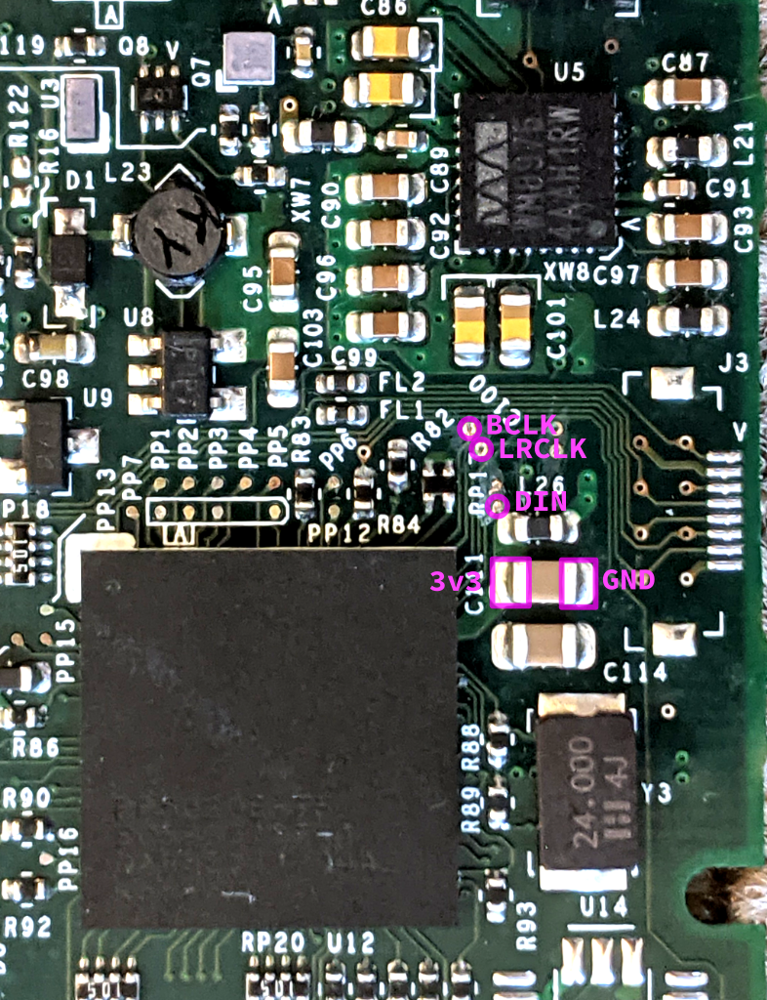

# ipod-toslink-mod
Adding optical digital audio output to classic iPods

NOTE: The current PCB files are untested. I am waiting for parts etc. to build and test the first batch, which should hopefully be some time in January 2021.

# Wiring

There are 5 wires that must be soldered to the iPod motherboard. You will need to scrape the soldermask from the top of the 3 vias before soldering, using a sharp knife.

